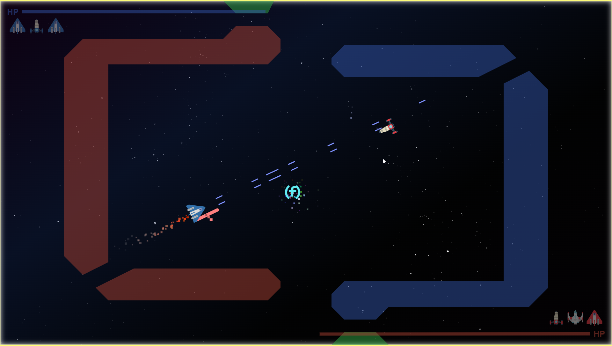
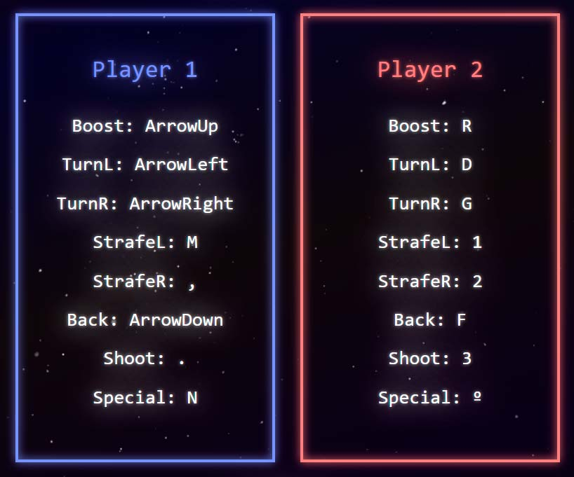

<h1 align="center">
   SpaceX Royale
</h1>

<h4 align="center">A spaceship fighting game with a misleading name.</h4>

 

  <a href="#about">About</a> •
  <a href="#usage">Usage</a> •
  <a href="#features">Features</a>

---

## About

<table>
<tr>
<td>
  
**SpaceX Royale** is a two player game built with HTML5, CSS3 and JS ES6. This game was developed with the purpose of learning these basic web development tools in their raw form with Object Oriented Programming & manual JS HTML templating, hence the use of zero external libraries.

The game may be played in any modern browser. It can be played on any device in landscape orientation, as long as a keyboard is available. Limited support for GamePad is provided.

This application was developed as a course project at <a href="https://geekshubsacademy.com/">GeeksHubs Academy</a>'s Full Stack Developer Bootcamp by Federico Báez in Valencia, Spain on 2021-2-01 to 2021-2-07.

 
Screenshot (PC, Chrome v87)

<h3>About the game</h3>
The year is 2035. With an exponential growth in wealth, in the last 15 years <b>Elon Musk</b> has gone from being the richest man in Earth to accumulating more wealth than 50 years worth of the planet's GDP. Musk, who already is president of Mars, decided to buy planet Earth in order to take down goverment's regulations in benefit of his business operations. In his infamous campaign to buy the Earth he persuaded voters of the "Earth Sale Referendum" to vote <b>Yes</b> by promising to take care of <b>climate change</b> once and for all. With an overwhelming majority of 92%, it was democratically decided that planet Earth would be sold to Musk, and that he would have the last word in the organization of Earth's resources and inhabitants. What nobody expected, is Musk's plan to end climate change was based on cutting the planet's population in half, and not exactly by the traditional means... The whole world population was divided into Team Blue and Team Red, and everyone would have to take part in a one of the millions upon millions of organized battles aboard SpaceX's brand new <b>Battle StarShips</b>. Whoever survived their battle would get to live in Musk's New Earth.

<b>Are you ready for your battle?</b>

</td>
</tr>
</table>

## Usage

You may play the game directly from its <a href="https://fbgoode.github.io/spacex-royale">GitHub Pages deployment</a>.

Alternatively, the application may be downloaded from <a href="https://github.com/fbgoode/spacex-royale/archive/main.zip">this link</a> and executed locally using any modern browser.

The game is a 2-player 3vs3 spaceship battle. Player 1 and 2 select their 3 spaceships and their weapons in a given order. In each selection, it's important to pick the combinations that will give you the best chance to defeat your enemy's ship.

 
Screenshot - PVP Menu (PC, Chrome v87)

Once the selections are confirmed the battle starts. Your ships can shoot, yaw, and propell sideways and backwards, but they're faster when moving forward using the main booster. The objective is to destroy all 3 enemy ships before your oponent destroys yours.

 
Screenshot - Controls (PC, Chrome v87)

 

## Features

* Game for two players on same device
* Game physics & graphics engine built from scratch
* One gamemode: 3 vs 3 battle
* 3 different spaceships to choose from: Tincan, Trooper & Heavy
* 3 different weapons to choose from: Classic, Double & Cannon
* Game controls with keyboard + limited GamePad/Joystick support for a better 2 player experience
* Menu navigation with keyboard, GamePad or mouse
* Responsive (although designed for landscape-oriented devices)
* Only requires browser with HTML5, CSS3 and JS ES6 support
* Includes music and sounds
